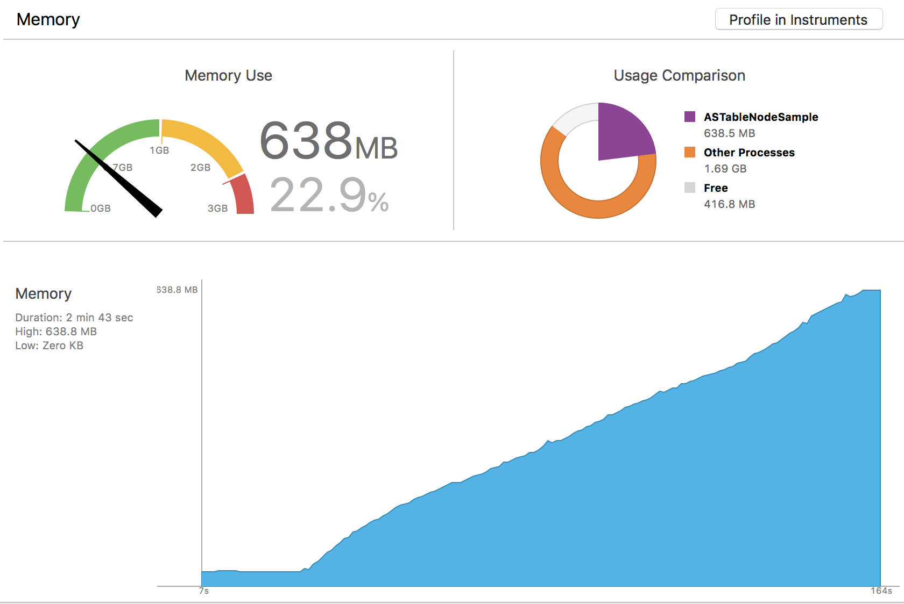
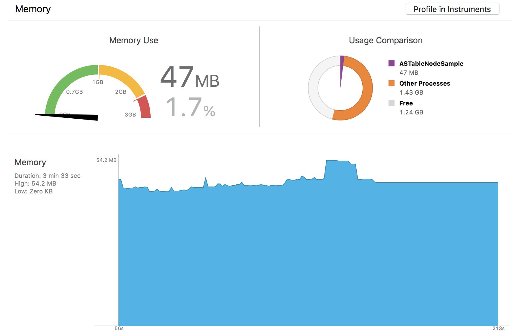

# ASTableNodeSample

# Installation
```bash
bundle install --path=vendor/bundler
bundle exec pod install
```

# Normal usage of ASTableNode

```swift
# AppDelegate.swift
window?.rootViewController = NormalTableNodeViewController()
//window?.rootViewController = PartialAllocateTableNodeViewController()
```



# Partially allocate cells

```swift
# AppDelegate.swift
//window?.rootViewController = NormalTableNodeViewController()
window?.rootViewController = PartialAllocateTableNodeViewController()
```



